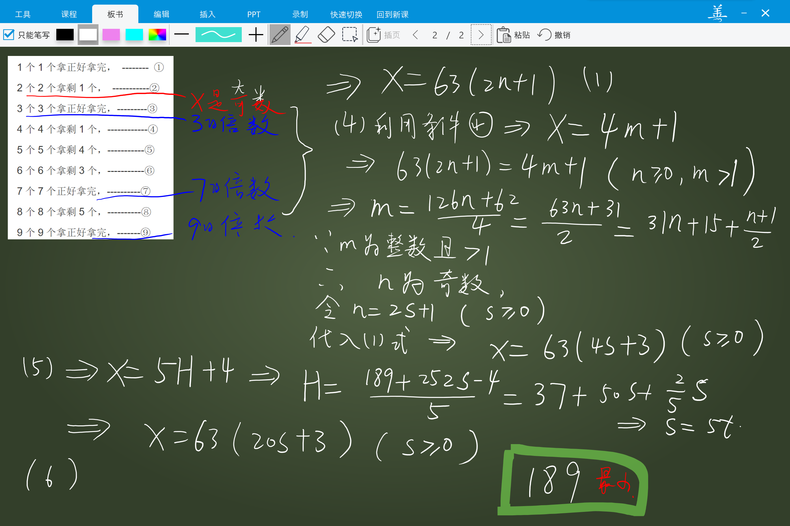

# IMOOC

IMOOC 是我以前开发的软件，是一款集合 电子板书 + PPT 播放与一体的软件，主要用于老师上课。上课时，老师手拿平板（例如surface pro4），该平板通过同屏器等方式投影到投影仪，这样老师可以拿着平板在课堂上随意走动，可以随时随地书写板书、展示PPT，学生不到讲台上在座位上也可以写做题。同时授课内容可以保存，随时可以调出。
## 优点
> * 板书和PPT合二为一，操作更加方便、快捷
> * 板书可以保存，随时可以调出来，

## 安装
安装可能会有一些困难，熟悉wpf C# 的应该是能够正常编译通过的。

## 版权声明

个人研究使用，请随意，如果想商业化，请联系我。我非常喜欢这个项目，在这个项目上付出了大量的思考，即便开始的时候，我就知道这个项目可能最终会失败。